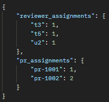
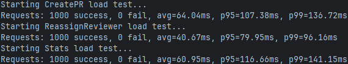
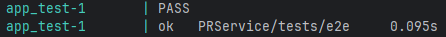

# **Сервис назначения ревьюеров для Pull Request’ов**

## Запуск

1. Для начала установим необходимые утилиты (нужны для доп. заданий, для запуска сервера можно не прописывать):

> make tools

2. Запустим сервер (docker-compose up)

> make up

## Доп. задания

1. Добавил эндпоинт статистики (/stats)

2. Нагрузочное тестирование (запускать при запущенном сервере)
> make load-test

Результаты:

3. Добавил метод массовой деактивации пользователей команды и безопасную переназначаемость открытых PR (/users/deactivate)

Метод выполняет массовую деактивацию пользователей команды, предварительно проверяя, что каждый из них может быть безопасно удалён из всех активных PR.
Если пользователь назначен ревьювером в активном PR, система пытается автоматически переназначить его на другого доступного члена команды.
Если замена не найдена - пользователь не деактивируется, а метод возвращает причину отказа.
Результат содержит статус по каждому пользователю.

4. Реализовал e2e тестирование
> make test
> 

5. Описал конфигурацию линтера (.golangci.yml)
> make lint
